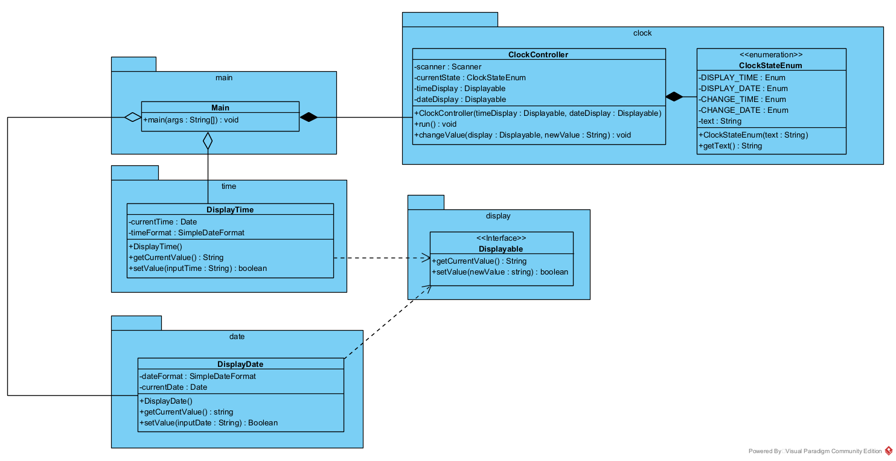

För att uppnå en enklare och mer underhållbar kodstruktur har jag uppdelat tid- och datumhanteringen i separata klasser. Detta följer principen om att varje komponent bör ha ett tydligt och avgränsat ansvar. Vidare har jag integrerat en robust felhantering för att hantera ogiltiga inmatningar och därigenom förbättra användarvänligheten och pålitligheten i programmet. Denna design är även inriktad på att vara tillståndsdriven, med hjälp av ClockStateEnum, vilket förenklar organisationen och förståelsen av programflödet. Det resulterar i en applikation som kan hantera visning och ändring av tid och datum på ett smidigt sätt, samtidigt som den är flexibel nog att enkelt utökas med nya funktioner efter behov.

